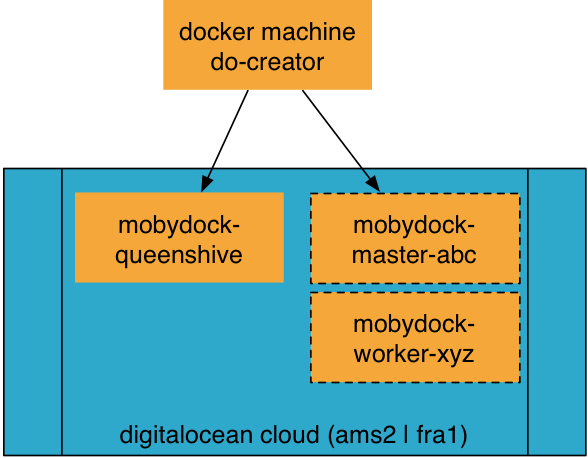

# Digital Ocean VM docker machine creator

Build a container to create [digitalocean](https://www.digitalocean.com/) docker machines.



* Based on [DinD](https://hub.docker.com/_/docker/)
* Access with ssh
* digitalocean cli

## Build the docker machine do creator

```
$ docker build -t bee42/do-docker-machine-creator .
```

### build args

| ARG             | Default     |
|:----------------|:------------|
| COMPOSE_VERSION | `1.9.0`     |
| MACHINE_VERSION | `0.9.0-rc2` |
| GLIBC_VERSION   | '2.23-r3'   |
| DOCTL_VERSION   | `1.5.0`     |

```
$ docker build --build-args COMPOSE_VERSION=1.8.1 -t xxx/do-docker-machine-creator:with_compose_1.8.1 https://github.com/bee42/docker-machine-digitalocean-creator .
```

## Usage of the creator

```
$ docker run -d --name do-creator \
  -p 2222:22 \
  --privilidged \
  bee42/do-docker-machine-creator
$ ssh creator@localhost:2222
# passwd creator
```

```
$ alias dip="docker inspect --format '{{ .NetworkSettings.IPAddress }}'"
$ dip do-creator
```


More services are available

| port | service                 |
|:-----|:------------------------|
| 22   | sshd                    |
| 2375 | uncrypted docker engine |
| 9001 | supervisord admin       |


## Usage with docker compose

```
$ export DIGITALOCEAN_ACCESS_TOKEN=xxx
$ export DIGITALOCEAN_SIZE=1gb
$ export DIGITALOCEAN_REGION=ams2
$ docker-compose up -d
$ docker-compose exec --user creator do-creator /bin/bash
```

access ssh port

```
$ ssh \
 -p $(docker-compose port do-creator 22 |awk 'BEGIN { FS=":" } /1/ { print $2 }') \
 creator@127.0.0.1
```

## create a machine

* Create a DIGITAL_OCEAN Account and create a Access Token

```
$ export DIGITALOCEAN_ACCESS_TOKEN=xyz
$ docker-machine create \
    --driver digitalocean \
    --digitalocean-private-networking \
    --digitalocean-region ams2 \
    --digitalocean-size 1gb \
    --digitalocean-access-token $DIGITALOCEAN_ACCESS_TOKEN \
    --engine-label "cluster=beehive" \
    --engine-label "role=queenshive" \
     do-beehive42
```

## doctl

```
$ export DIGITALOCEAN_ACCESS_TOKEN=MY_TOKEN
$ mkdir -p $HOME/.config/doctl
$ cat >$HOME/.config/doctl/config.yaml <<EOF
access-token: ${DIGITALOCEAN_ACCESS_TOKEN}
output: text
EOF
$ doctl compute droplet list
```

* https://github.com/digitalocean/doctl
* https://www.digitalocean.com/community/tutorials/how-to-use-doctl-the-official-digitalocean-command-line-client


## Make your certs transferable

```
$ dctrl master-node
$ CONTROL=master-node
$ eval \$(docker run --rm --volumes-from $CONTROL alpine
       sed 's/DOCKER_/DOCKERCONTROL_/' /docker/env)"
# start a container to access this engine
$ docker run --volumes-from $CONTROL \
  -e DOCKER_HOST=\$DOCKERCONTROL_HOST \
  -e DOCKER_TLS_VERIFY=\$DOCKERCONTROL_TLS_VERIFY \
  -e DOCKER_CERT_PATH=\$DOCKERCONTROL_CERT_PATH \
  -e DOCKER_API_VERSION=\$DOCKERCONTROL_API_VERSION \
  …
```

* https://github.com/jpetazzo/dctrl

## Links

* http://label-schema.org/rc1/
* https://github.com/andyshinn/alpine-pkg-glibc
* https://github.com/jeanblanchard/docker-alpine-glibc/blob/master/Dockerfile


Regards
Peter

<peter.rossbach@bee42.com> @PRossbach
