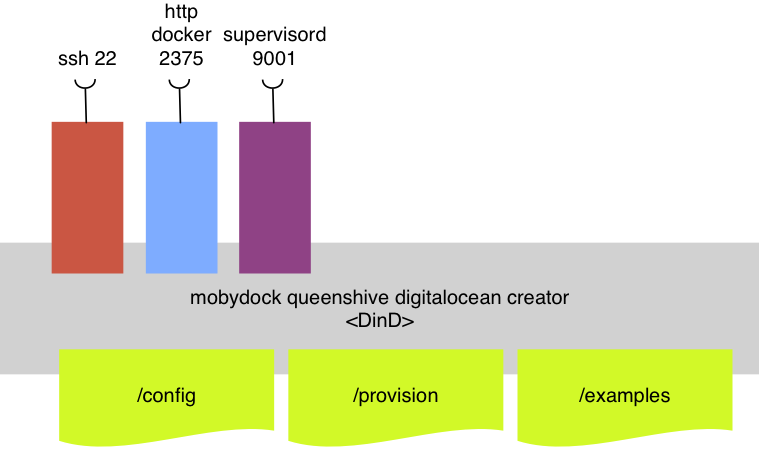

# Digital Ocean VM docker machine creator

build

```
$ docker build -t bee42/do-docker-machine-creator .
```

usage on Docker for mac

```
$ docker run -d --name do-creator \
  -p 2222:22 \
  --privilidged \
  bee42/do-docker-machine-creator
$ ssh creator@localhost:2222
# passwd creator
```


## Usage of the creator
```
$ docker run -d -p 2222:22 \
  --name do-creator
  -v `pwd`/config:/config \
  --privileged \
  bee42/do-docker-machine-creator
$ ssh -p 2222 creator@<docker do-docker-machine-creator ip>
# pw: creator
```

```
$ alias dip="docker inspect --format '{{ .NetworkSettings.IPAddress }}'"
$ dip do-creator
```



More services are available

| port | service                 |
|:-----|:------------------------|
| 22   | sshd                    |
| 2375 | uncrypted docker engine |
| 9001 | supervisord admin       |

## create a machine

* Create a DIGITAL_OCEAN Account and create a Access Token

```
$ export DIGITALOCEAN_ACCESS_TOKEN=xyz
$ docker-machine create \
    --driver digitalocean \
    --digitalocean-private-networking \
    --digitalocean-region ams2 \
    --digitalocean-size 1gb \
    --digitalocean-access-token $DIGITALOCEAN_ACCESS_TOKEN \
    --engine-label "cluster=beehive" \
    --engine-label "role=queenshive" \
     do-beehive42
```

## doctl

```
$ export DIGITALOCEAN_ACCESS_TOKEN=MY_TOKEN
$ mkdir -p $HOME/.config/doctl
$ cat >$HOME/.config/doctl/config.yaml <<EOF
access-token: ${DIGITALOCEAN_ACCESS_TOKEN}
output: text
EOF
$ doctl compute droplet list
```

* https://github.com/digitalocean/doctl
* https://www.digitalocean.com/community/tutorials/how-to-use-doctl-the-official-digitalocean-command-line-client

## Links

* http://label-schema.org/rc1/
* https://github.com/andyshinn/alpine-pkg-glibc
* https://github.com/jeanblanchard/docker-alpine-glibc/blob/master/Dockerfile

***

Regards
Peter

<peter.rossbach@bee42.com> @PRossbach
